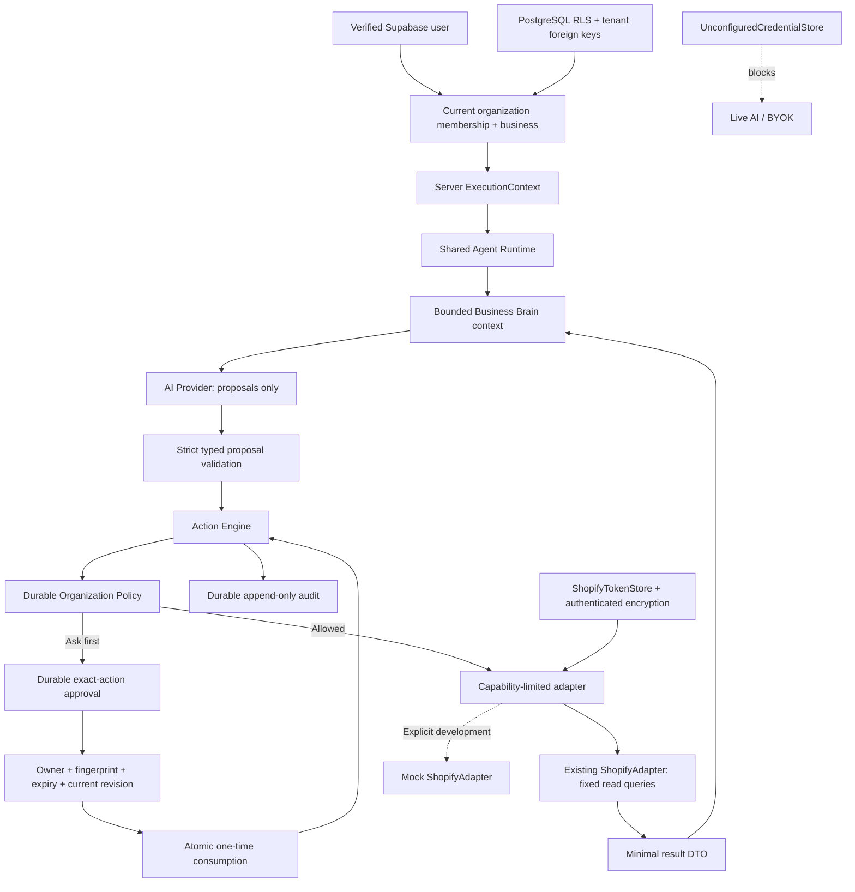

# Anti-Nerd backend architecture

The backend has Supabase Auth, verified workspaces and durable PostgreSQL repositories. The Shopify phase adds standalone installation, purpose-bound encrypted credentials, expiring offline token refresh and real reads through the existing ShopifyAdapter and Action Engine. Connected Store, Products, Orders, Customers and Inventory surfaces use real data; unlinked stores have explicit demos/connect states. Financial dashboard metrics, ads, Research and Brain visualizations remain demonstrations. See [shopify.md](shopify.md) for installation and deployment requirements.

**Shopify read-only installation is configurable. Live AI, BYOK, Shopify writes and autonomous execution remain disabled.** A configured Supabase project enables identity and persistence only. Without configuration the app shows the Anti-Nerd login setup state and protected pages redirect there; no fake login or fallback organization is created.

## Layers and ownership

| Layer                                                 | Implementation                                                          |
| ----------------------------------------------------- | ----------------------------------------------------------------------- |
| Safe shared contracts / catalog                       | `types/backend.ts`, `types/workspace.ts`, `lib/backend/tool-catalog.ts` |
| Supabase public config / optional browser client      | `lib/supabase/`                                                         |
| Session refresh                                       | `proxy.ts`, `lib/server/db/client.ts`                                   |
| Verified identity and organization context            | `lib/server/auth/context.ts`                                            |
| Auth actions / origin checks                          | `lib/server/auth/actions.ts`                                            |
| Workspace mutations / repositories                    | `lib/server/db/actions.ts`, `workspace.ts`, `repositories.ts`           |
| Durable mock composition                              | `lib/server/db/runtime.ts`                                              |
| PostgreSQL schema, RLS and transactions               | `supabase/migrations/`                                                  |
| Central durable rate limit                            | `lib/server/security/rate-limit.ts`                                     |
| AI Provider                                           | `lib/server/ai/provider.ts`, `mock-provider.ts`, `registry.ts`          |
| Shared Agent Runtime                                  | `lib/server/runtime.ts`                                                 |
| Business Brain                                        | `lib/server/brain/context.ts`                                           |
| Policy Engine                                         | `lib/server/policy/engine.ts`                                           |
| Action Engine / persistence contracts                 | `lib/server/actions/engine.ts`, `stores.ts`                             |
| Integration adapters                                  | `lib/server/integrations/adapter.ts`, `shopify.ts`, `mock-shopify.ts`   |
| Credential boundary                                   | `lib/server/security/credentials.ts`                                    |
| Shopify installation/token/read composition           | `lib/server/shopify/`, `integrations/shopify-connection.ts`             |
| Original isolated mock / blocked generic live factory | `lib/server/foundation.ts`                                              |

## Identity, tenancy and storage

Supabase SSR clients use cookies. Proxy verifies claims and refreshes cookies; the server DAL verifies the current user with `getUser()` and looks up current membership. `ExecutionContext` is built from that identity, membership role and verified active business. The source `live` in this identity context means a real authenticated actor; it does not enable a live executor. The durable preview composition explicitly changes execution source to `mock` and constructs only MockAIProvider/MockShopifyAdapter.

One user can join multiple organizations. One organization can own several businesses. Roles are owner/admin/member/viewer. Owners alone change policies and approve/reject. Owners/admins/members can edit instructions. Viewers read only. Browser cookies request a selection; the server revalidates membership/business ownership on every context resolution. Protected URLs are unchanged, now under an authenticated route group. Onboarding creates organization, owner membership, first business and disconnected metadata atomically without requiring Shopify.

Session clients read through RLS and call narrowly scoped authenticated mutation RPCs. A separate server-only Supabase secret client supports internal action/audit repositories and rate counters; it bypasses RLS and is never used to trust a browser-supplied tenant. Database approval RPCs recheck membership, action binding and revision. All public tables use RLS; composite foreign keys enforce tenant ownership across businesses, actions and approvals. See [database.md](database.md) for the complete schema, privileges, migration procedure and setup instructions; [authentication.md](authentication.md) for sessions and email setup.

## Provider and runtime boundaries

`AIProvider` exposes generateText, reason, structuredOutput and toolUse, with optional vision. Reasoning returns a decision summary/uncertainties, not internal chain-of-thought. Structured output is validated by the application. A tool call is a proposal, never direct execution. Only MockAIProvider is constructible. Selecting Anti-Nerd AI, OpenAI, Anthropic or Google in Settings does not connect it; those model/usage choices remain page-local preferences. Safe connection records now persist as disconnected metadata.

Store, Product, Research, Ads, Creative, Support, Finance and Operations share one runtime with distinct tool allowlists. Every proposal is validated before any executes; requests permit at most three proposals and 6,000 characters of retrieved context. There is no recurring loop. AI objects receive no adapter, credential, raw GraphQL executor, shell or arbitrary transport.

Brain retrieval currently uses selected mock context. Saved business instructions are durable inputs for a future retrieval adapter, not automatically sent to a provider. The current mock observer tracks completed action IDs; it does not perform semantic learning. Failed actions and approval requests do not become facts. Frontend Brain demo state remains separate.

## Policy and approval lifecycle

The application tool registry determines capability/impact. Defaults remain READ_ONLY for reads and ASK_FIRST for writes/high-impact operations. DENIED rejects, READ_ONLY accepts only registered reads, ASK_FIRST creates an exact-action approval. AUTOMATIC_WITH_LIMITS requires a supported explicit absolute new-price limit with currency; unknown/missing limits deny. AUTOMATIC still requires review for high-impact actions. Confidence does not override policy. No setting enables an unimplemented write.

Policies persist per capability with an organization-wide monotonic revision. An owner edit locks the organization, checks the expected revision and increments it. Policy snapshots are read consistently. Limits currently support integer minor-unit maximum new price in EUR/USD/GBP only. Percentage changes, aggregate spend and rolling quotas are not implemented. A proposal's claimed current price is not authorization evidence; real writes require trusted snapshots and optimistic concurrency.

Actions reserve a UUID and immutable canonical validated proposal/fingerprint with trusted attribution. Reusing the ID with changed content is rejected. Approvals bind organization, action, fingerprint, revision and a maximum fifteen-minute expiry. The action engine re-evaluates policy, and PostgreSQL atomically rechecks owner membership/current revision/expiry/action state and consumes once using database time. Rejection is also single-use and audits transactionally. Receipt and new approval persistence share a transaction. Terminal actions cannot transition again.

Audit records contain organization/actor/agent/provider attribution, capability action, resource, reason/confidence, decision, validated change parameters and result metadata. Raw API bodies, unrelated customer data and credentials are excluded. `rollbackAvailable` is false. Activity reads real organization-scoped audit records; Dashboard Needs you reads durable approvals. Development fixtures pass through the same runtime/policy/action path. Approval of a mock price write records `not_implemented`; it never calls Shopify.

The original request-scoped mock stores remain for isolated unit/development previews. Durable stores implement the existing contracts for authenticated preview requests. Audit append and receipt writes are not a distributed transaction with an external vendor. Interrupted work can remain proposed/started; there is no automatic retry of external actions. Outbox/reconciliation, immutable execution snapshots and vendor idempotency remain gates before real writes.

## Shopify and credential boundary

`ShopifyAdapter` retains seven bounded fixed GraphQL read operations, pinned Admin API `2026-07`, canonical myshopify hosts, ten-second timeout, server token headers, no shared cache and no redirects. It checks organization/connection/scopes before credential access. Throttle, HTTP, GraphQL, version drift and malformed responses fail with sanitized errors; partial data is discarded. The adapter is now wired to verified tenant repositories and the ShopifyTokenStore. UI/API reads pass through the existing policy and Action Engine; the separate OAuth verification read is owner-authorized and preceded by the durable connection-start audit.

Supported read contracts: getStore; listProducts/getProduct; listOrders/getOrder; listCustomers (ID/count only); getInventory (item ID/SKU/tracking only). Lists limit 1–50 items and require explicit cursor paging. No automatic whole-store export, protected customer details, expanded order history or location quantities. Write contracts remain typed/policy-mapped only: updateProduct, updateProductPrice, updateInventory, createDiscount, refundOrder and publishStoreChange. No Shopify mutation implementation exists.

`ShopifyVault` uses standard AES-256-GCM and associated data binding organization/business/connection/reference/purpose/key version. Token pairs are encrypted in private PostgreSQL storage. The verified connection row contains safe metadata and a reference. Expiring offline tokens rotate under a fenced database lease. State consumption, metadata transitions, credential replacement and integration audits use narrow service-only transactions; browser roles cannot call these RPCs. Production requires managed-secret key injection and valid versioned keys. `UnconfiguredCredentialStore` remains fail-closed for AI/BYOK. There is no general live-provider factory. See [security.md](security.md) and [shopify.md](shopify.md).

Live action source is persisted immutably and reads remain business-scoped on approval. All live action tools must be registered reads at the database boundary. A reconnected store cannot turn a mock approval into live execution. Disconnect/uninstall fence token work and delete local ciphertext; history is preserved subject to the deployment's reviewed retention/privacy process. Compliance webhooks create pending minimized fulfillment requests, not automatic compliance certification.

## HTTP and UI boundaries

| Surface                                   | Current behavior                                                                                                                                            |
| ----------------------------------------- | ----------------------------------------------------------------------------------------------------------------------------------------------------------- |
| Protected app routes                      | Verified identity and workspace; login/onboarding redirect as appropriate.                                                                                  |
| Login/signup/recovery                     | Supabase email/password with server Origin validation and durable throttles. Missing configuration fails closed.                                            |
| Workspace Server Actions                  | Session/membership checks, bounded inputs, scoped RPCs and sanitized fixed error messages.                                                                  |
| Auth confirmation                         | Allowed token type + fixed local destinations; no arbitrary next URL.                                                                                       |
| GET /api/backend/status                   | Configuration presence only, not a connectivity/migration health check. No tenant/credential data; no-store.                                                |
| POST /api/development/runtime             | Original isolated public development fixture, bounded fixed read/price scenario, no persistence; production 404.                                            |
| Activity → development fixture            | Authenticated, organization-scoped durable mock runtime; fixture creation disabled in production.                                                           |
| POST /api/integrations/shopify/connect    | Configured: owner, canonical Origin, bounded shop input, durable state, secure browser cookie and Shopify authorization URL. Otherwise 503.                 |
| GET /api/integrations/shopify/callback    | Configured: session/state/cookie/HMAC verification, token exchange, encrypted staging and shop verification. Fixed success/failure redirect; otherwise 503. |
| POST /api/integrations/shopify/read       | Authenticated bounded read proposal through policies/actions/audit; never arbitrary queries.                                                                |
| POST /api/integrations/shopify/disconnect | Owner, canonical Origin and explicit confirmation; deletes local credentials.                                                                               |
| POST /api/integrations/shopify/webhooks   | Raw-body HMAC, signed shop binding, deduplication, uninstall and privacy receipt.                                                                           |
| POST /api/ai-engine/connection            | Still 503; no key input parsed or persisted.                                                                                                                |

Connected Shopify commerce views show real data and never silently fall back to fixtures. Financial/ads/Research/automation/Brain previews remain demos. Provider metadata stays disconnected. No invitation, billing, background task, live AI or autonomous execution was added.

## Validation and release limits

Run `npm run test:backend`, `npm run test:shopify`, `npm run test:persistence`, `npm run test:brain`, `npm run lint`, `npm run typecheck`, `npm run build`, then `npm run check:boundaries`. The boundary check follows transitive client imports, recognizes Next's Server Action references, enforces server-only modules and scans actual production browser bundles for secret/transport markers.

Persistence tests execute real migration SQL in PGlite PostgreSQL with fixture auth roles, not a live Supabase account. They cover tenant read/write isolation, role permissions, workspace switching, policy revision/limits, atomic consumption/replay/expiry, immutable proposals/audit, instructions, metadata and durable throttles. PGlite serializes database connections; a real multi-connection contention test and hosted Supabase/PostgREST/auth-flow validation are still required. No Shopify credentials were configured and no Shopify/AI account was contacted. See the current [Shopify verification notes](shopify.md#verification-performed--2026-09-25) for the read-only Supabase schema check and remaining setup. The previous phase's all-screens browser test does not prove the newly authenticated data flow; rerun it with a configured development Supabase project.

Local unauthenticated browser/HTTP checks verify login/setup rendering, protected redirects and blocked external endpoints. See the phase verification notes in [database.md](database.md) and the completion report for exact executed checks. The browser extension's existing `cz-shortcut-listen` body injection may cause a development hydration warning; it is not suppressed. Next's unrelated parent-directory lockfile notice may remain.

References: [Supabase SSR](https://supabase.com/docs/guides/auth/server-side/creating-a-client), [RLS](https://supabase.com/docs/guides/database/postgres/row-level-security), [password auth](https://supabase.com/docs/guides/auth/passwords), [Shopify GraphQL](https://shopify.dev/docs/api/admin-graphql/latest), [Shopify standalone authorization](https://shopify.dev/docs/apps/build/authentication-authorization/authenticate-standalone-apps). Installed Next.js auth/cookies/proxy/data-security guides were consulted.

Stop here: live OpenAI/Claude, Shopify writes/mutations, autonomous execution and Product Research remain later phases.
